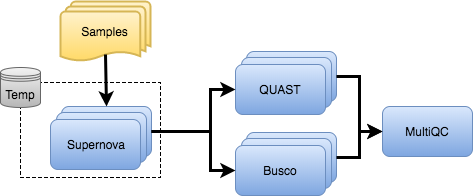

# 

**De novo assembly pipeline for 10X linked-reads.**

[](https://travis-ci.com/nf-core/neutronstar)
[](https://github.com/nf-core/neutronstar/actions)
[](https://github.com/nf-core/neutronstar/actions)
[](https://www.nextflow.io/)

[](https://hub.docker.com/r/nfcore/neutronstar/)
[](https://hub.docker.com/r/nfcore/supernova/)
[](https://www.sylabs.io/docs/)
[](http://bioconda.github.io/)

## Table of Contents

1. [Introduction](README.md#introduction)
   * [Disclaimer](README.md#disclaimer)
2. [Important installation information](docs/installation.md)
   * [Singularity](docs/installation.md#singularity)
   * [Busco data](docs/installation.md#busco-data)
3. [Usage instructions](docs/usage.md)
   * [Single assembly](docs/usage.md#single-assembly)
   * [Multiple assemblies](docs/usage.md#multiple-assemblies)
   * [Advanced usage](docs/usage.md#advanced-usage)
4. [Pipeline output](docs/output.md)
5. [Pipeline overview](README.md#pipeline-overview)
6. [Credits](README.md#pipeline-overview)

---------

## Introduction

nf-core/neutronstar is a bioinformatics best-practice analysis pipeline used for de-novo assembly and quality-control of 10x Genomics Chromium data.
The pipeline is built using [Nextflow](https://www.nextflow.io), a workflow tool to run tasks across multiple compute infrastructures in a very portable manner. It comes with docker containers making installation trivial and results highly reproducible.

## Quick Start

i. Install [`nextflow`](https://nf-co.re/usage/installation)

ii. Install one of [`docker`](https://docs.docker.com/engine/installation/), [`singularity`](https://www.sylabs.io/guides/3.0/user-guide/) or [`conda`](https://conda.io/miniconda.html)

iii. Download the pipeline and test it on a minimal dataset with a single command

```bash
nextflow run nf-core/neutronstar -profile test,<docker/singularity/conda>
```

iv. Start running your own analysis!

```bash
nextflow run nf-core/neutronstar -profile <docker/singularity/conda> --id assembly_id --fastqs fastq_path --genomesize 1000000
```

See [usage docs](docs/usage.md) for all of the available options when running the pipeline.

## Disclaimer

This software is in no way affiliated with nor endorsed by 10x Genomics.

## Pipeline overview



## Credits

nf-core/neutronstar was originally written by Remi-Andre Olsen (@remiolsen).

## Contributions and Support

If you would like to contribute to this pipeline, please see the [contributing guidelines](.github/CONTRIBUTING.md).

For further information or help, don't hesitate to get in touch on [Slack](https://nfcore.slack.com/channels/nf-core/neutronstar) (you can join with [this invite](https://nf-co.re/join/slack)).

## Citation

If you use nf-core/neutronstar for your analysis, please cite it using the following doi:

You can cite the `nf-core` pre-print as follows:

> Ewels PA, Peltzer A, Fillinger S, Alneberg JA, Patel H, Wilm A, Garcia MU, Di Tommaso P, Nahnsen S. **nf-core: Community curated bioinformatics pipelines**. *bioRxiv*. 2019. p. 610741. [doi: 10.1101/610741](https://www.biorxiv.org/content/10.1101/610741v1).
