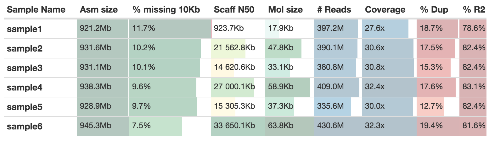
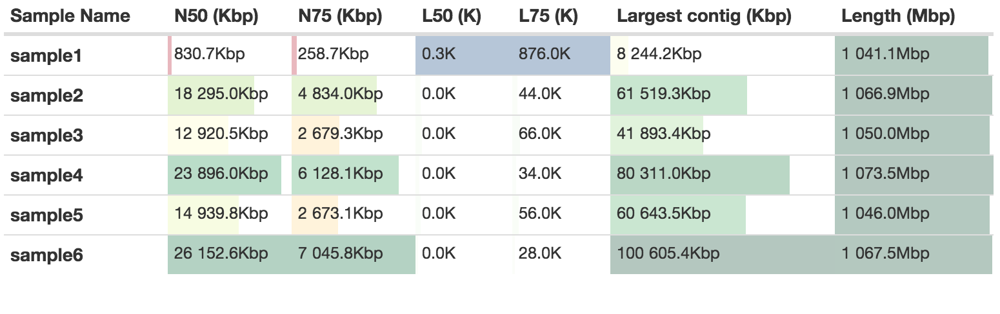
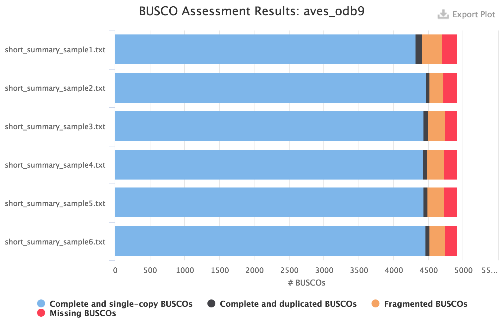

# nf-core/neutronstar: Output

This document describes the output produced by the pipeline. Most of the plots are taken from the MultiQC report, which summarises results at the end of the pipeline.

## Pipeline overview

The pipeline is built using [Nextflow](https://www.nextflow.io/)
and processes data using the following steps:

* [Supernova](https://support.10xgenomics.com/de-novo-assembly)
* [QUAST](http://bioinf.spbau.ru/quast)
* [BUSCO](http://busco.ezlab.org/)
* [MultiQC](http://multiqc.info/)

## Supernova

By default the output from Supernova will be stored in two places.

1. `./results/supernova/sample_id` - This contains the assembly graph files, log files and statistics from supernova_asm1. See the [documentation](https://support.10xgenomics.com/de-novo-assembly/software/pipelines/latest/output/overview) from 10XG for more details.

2. `./results/assemblies/sample_id[.phased].fasta` - These are the assembly fasta files. Two of the four [outputs](https://support.10xgenomics.com/de-novo-assembly/software/pipelines/latest/output/generating) from Supernova are generated:
    * sample_id.fasta, the `pseudohaploid` version
    * sample_id.phased.fasta, the `megabubbles` version where haplotypes are included as two separate fasta entries.

To generate the two other output types, for instance `raw` you can use the command:

```bash
supernova mkoutput --asmdir=./results/supernova/sample_id/outs/assembly --style=raw --outprefix=sample_id.raw
```

The MultiQC report will add the [statistics](https://support.10xgenomics.com/de-novo-assembly/software/pipelines/latest/output/asm-stats) from Supernova to a table


---------

## QUAST

Quast will give a measurement of assembly contiguity independent of Supernova. There will be a slight difference because of the way that Supernova calculates this. Compare for instance the scaffold N50 values with the ones from the previous table:



---------

## BUSCO

Please see the user manual for [BUSCO](https://busco.ezlab.org/) to understand the meaning of the category of orthologs found in the assembly. For instance for a eukaryote species, you might want to use the `eukaryota_odb9` dataset to quickly get a result. However it is recommended to use the most specific dataset available, for instance for birds the aves_odb9 dataset:



## MultiQC

[MultiQC](http://multiqc.info) is a visualisation tool that generates a single HTML report summarising all samples in your project. Most of the pipeline QC results are visualised in the report and further statistics are available in within the report data directory.

The pipeline has special steps which allow the software versions used to be reported in the MultiQC output for future traceability.

**Output directory: `results/multiqc`**

* `Project_multiqc_report.html`
  * MultiQC report - a standalone HTML file that can be viewed in your web browser
* `Project_multiqc_data/`
  * Directory containing parsed statistics from the different tools used in the pipeline

For more information about how to use MultiQC reports, see [http://multiqc.info](http://multiqc.info)
